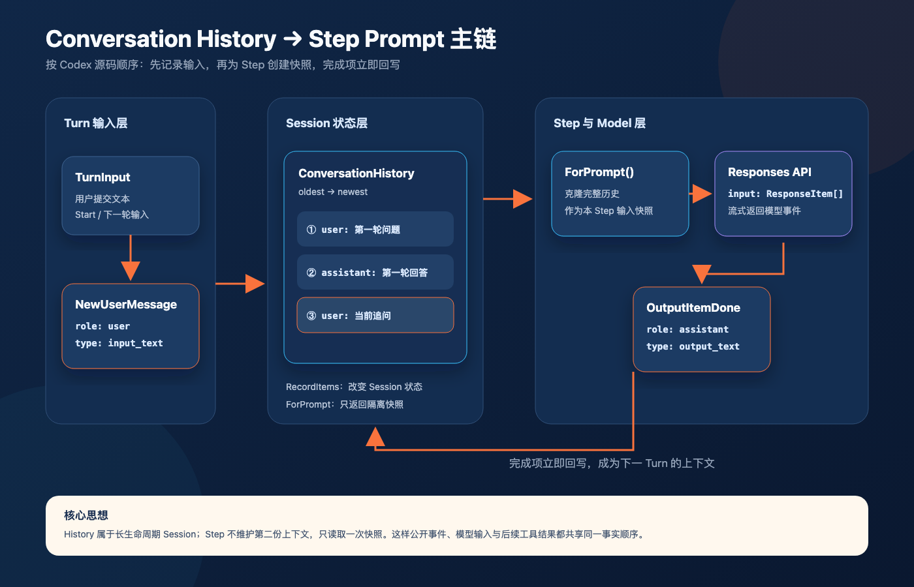
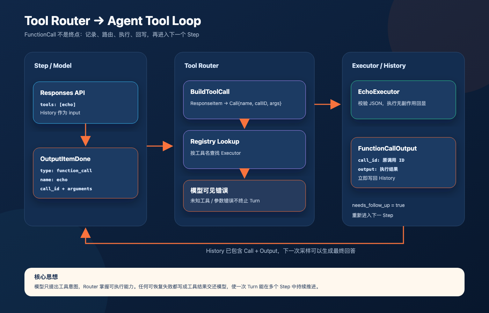
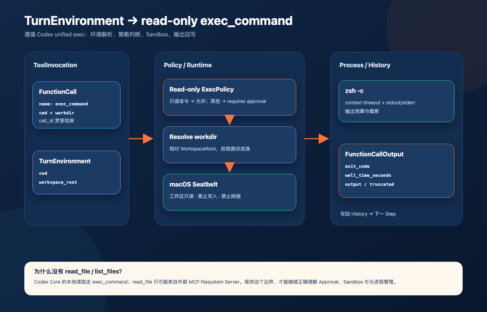
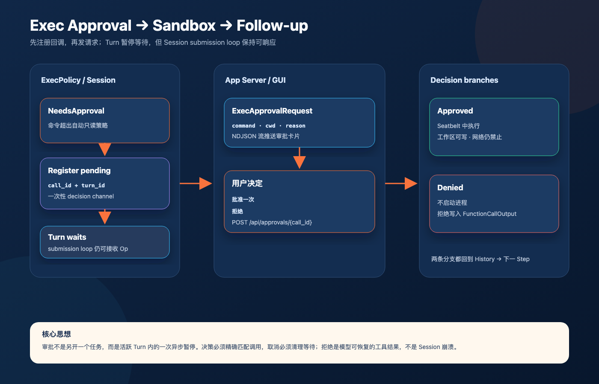
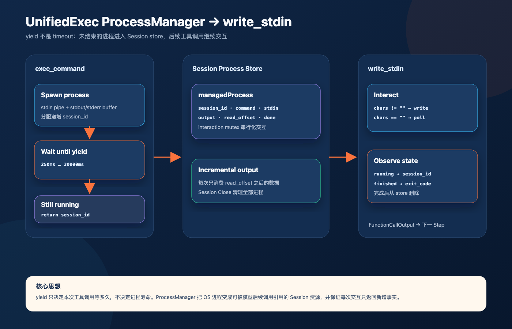
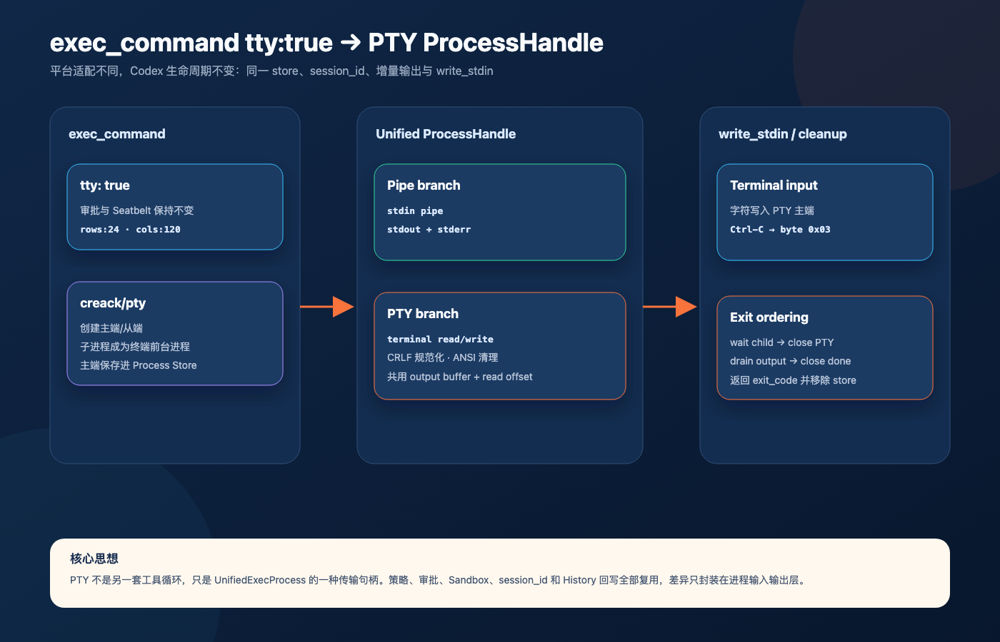
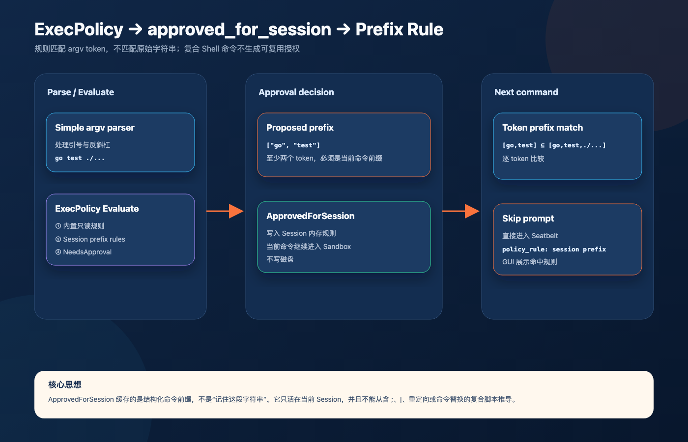

# Codex 源码一致性清单

本文件记录 LOB Codex 与 OpenAI Codex 源码的逐项映射。完成意味着 Go 实现保留了 Codex
对应模块的核心调用链、状态机、事件顺序、错误语义和生命周期，而不只是实现了相似功能。

## 一致性规则

- Codex 源码是主逻辑的唯一事实来源。
- Go 类型可以不同，但职责、输入、输出和状态转换必须等价。
- 平台相关实现允许不同，接口、授权边界和失败语义必须一致。
- 临时教学实现必须标记为“原型”，不能被视为已完成的 Codex 等价实现。
- 每个差异都要写明 Codex 行为、当前行为、偏离原因和补齐计划。

## 当前映射

| 能力 | Codex 源码 | LOB Codex | 状态 | 说明 |
|---|---|---|---|---|
| 协议事件 | `codex-rs/protocol` | `internal/protocol` | 部分对齐 | 已拆分 `ResponseEvent` 与公开 `Event/EventMsg`，并实现 Message 类型的 `ResponseItem` 子集 |
| Session/Turn | `codex-rs/core/src/session` | `internal/session` | 部分对齐 | 已还原 Submission、后台 loop、RegularTask、Turn/StepContext，以及 Conversation History 的采样与回写主链 |
| 模型客户端 | `codex-rs/core` 模型客户端 | `internal/model` | 部分对齐 | Responses API 现接收 `ResponseItem[]` 并消费文本 Delta、OutputItemDone、Completed；重试和其他 Item 类型尚未对齐 |
| 工具路由 | `codex-rs/core/src/tools` | `internal/tools` | 部分对齐 | 已实现 Tool Definition、Registry/Router、ToolInvocation、echo 与 exec_command 路由 |
| 命令执行 | `codex-rs/core/src/tools/handlers/unified_exec` | `internal/tools` | 部分对齐 | 已实现 TurnEnvironment、审批、Seatbelt、ProcessManager、pipe/PTY、session_id、增量输出与 write_stdin |
| MCP | `codex-rs/core/src/mcp.rs` | `internal/mcp` | 未开始 | 必须对齐连接、工具刷新、审批和调用语义 |
| App Server | `codex-rs/app-server` | `internal/appserver` | 原型 | 服务现持有长生命周期 Session；线程路由和多会话协议尚未实现 |

## Session → Turn → Step 调用链

可编辑源图位于 [`diagrams/session-turn-step.svg`](./diagrams/session-turn-step.svg)。

| 顺序 | Codex | LOB Codex |
|---|---|---|
| 1 | `SessionIo::submit` 创建 `Submission` | `IO.Submit` 创建 `Submission` |
| 2 | `submission_loop` 分派 `Op` | `submissionLoop` 分派 `Op` |
| 3 | `turn_input::handle` 决定 start/steer/reject | `handleTurnInput` 当前实现 start，steer/reject 语义待补 |
| 4 | `Session::spawn_task/start_task` 启动后台任务 | `spawnRegularTask` 启动可取消 goroutine |
| 5 | `RegularTask::run` 发送 `TurnStarted` | `runRegularTask` 发送 `TurnStarted` |
| 6 | `run_turn` 捕获 `StepContext` 并循环采样 | `runTurn` 捕获 `StepContext` 并保留 follow-up 循环 |
| 7 | `run_sampling_request` 消费 `ResponseEvent` | `runSamplingRequest` 消费内部 `ResponseEvent` |
| 8 | `on_task_finished` 发送终态事件 | `onTaskFinished` 发送 TurnComplete/TurnAborted |

## Conversation History 调用链

可编辑源图位于 [`diagrams/conversation-history.svg`](./diagrams/conversation-history.svg)。

| 顺序 | Codex | LOB Codex |
|---|---|---|
| 1 | `record_pending_input` 将 Turn 输入转换并记录为 `ResponseItem` | `runTurn` 将 `TurnInput` 转为用户 `ResponseItem` 后调用 `RecordItems` |
| 2 | `clone_history().for_prompt(...)` 返回当前 Step 的模型输入快照 | `ConversationHistory.ForPrompt()` 返回隔离切片 |
| 3 | Model Client 接收 `Vec<ResponseItem>` | `model.Request.Input` 接收 `[]protocol.ResponseItem` |
| 4 | `ResponseEvent::OutputItemDone` 交给输出处理并记录 | `ResponseOutputItemDone` 到达时立即回写 Conversation History |
| 5 | 下一 Turn 再次从完整 History 构造 prompt | 长生命周期 Session 保留历史并向下一次请求发送完整数组 |

## Tool Router → Agent Tool Loop

可编辑源图位于 [`diagrams/tool-router-loop.svg`](./diagrams/tool-router-loop.svg)。

| 顺序 | Codex | LOB Codex |
|---|---|---|
| 1 | StepContext 持有本 Step 的 ToolRouter 与模型可见 ToolSpec | `captureStepContext` 捕获 Router，请求携带 `[]tools.Definition` |
| 2 | `OutputItemDone(FunctionCall)` 交给 `ToolRouter::build_tool_call` | `BuildToolCall` 将 FunctionCall ResponseItem 转为内部 Call |
| 3 | 原始调用先记录，再交给工具 Runtime | FunctionCall 先写 History，再由 Router 查找并执行 echo |
| 4 | 参数或路由错误转换为给模型的 FunctionCallOutput | 未知工具与参数错误均生成模型可见输出，不直接终止 Turn |
| 5 | 工具结果写回 History，并设置 `needs_follow_up` | FunctionCallOutput 写回 History，下一 Step 从完整历史继续采样 |
| 6 | 客户端接收工具调用生命周期事件 | App Server 以 NDJSON 推送 started/completed，GUI 显示工具卡片 |

## TurnEnvironment → Read-only exec_command

可编辑源图位于 [`diagrams/unified-exec-readonly.svg`](./diagrams/unified-exec-readonly.svg)。

Codex Core 不提供本地 `read_file` / `list_files` 独立工具；本地文件读取通过
`exec_command` 完成，外部 MCP Server 可以另外提供同名 filesystem 工具。LOB Codex 因此没有
自行发明文件工具，而是实现 unified exec 的第一个安全切片。

| 顺序 | Codex | LOB Codex |
|---|---|---|
| 1 | ToolInvocation 携带 Call、StepContext 与 TurnEnvironment | Invocation 携带 Call、WorkingDirectory 与 WorkspaceRoot |
| 2 | Handler 解析 cmd/workdir/timeout 等参数 | ExecCommandExecutor 使用同名参数子集 |
| 3 | ExecPolicy 决定允许、拒绝或申请审批 | 当前只读 allowlist 自动允许，其余返回“requires approval”模型结果 |
| 4 | UnifiedExecRuntime 编排审批、Sandbox 与 ProcessManager | 当前直接进入 macOS Seatbelt，只读工作区且禁止写入和网络 |
| 5 | ExecCommandToolOutput 截断后转 FunctionCallOutput | 返回 exit_code、wall_time_seconds、output 与截断标记 |

## Exec Approval 暂停与恢复

可编辑源图位于 [`diagrams/approval-sandbox-loop.svg`](./diagrams/approval-sandbox-loop.svg)。

| 顺序 | Codex | LOB Codex |
|---|---|---|
| 1 | ExecPolicy 产生 `NeedsApproval` | 非只读命令产生 ApprovalRequest |
| 2 | 先注册 `call_id + approval_id` oneshot，再发送事件 | 先写入 pending map，再发送 ExecApprovalRequest |
| 3 | Turn 等待 ReviewDecision，同时允许 submission loop 接收 Op | 工具 goroutine 等待 channel，submission loop 继续接收审批 Op |
| 4 | Approved 进入 Sandbox；Denied 作为可恢复拒绝 | 批准一次开放工作区写权限但仍禁网；拒绝生成 FunctionCallOutput |
| 5 | 取消时清理 pending approval 并中止等待 | 请求取消删除 pending map，工具返回 context cancellation |

## UnifiedExec ProcessManager

可编辑源图位于 [`diagrams/unified-exec-process-manager.svg`](./diagrams/unified-exec-process-manager.svg)。

| 顺序 | Codex | LOB Codex |
|---|---|---|
| 1 | ProcessManager 启动进程并注册 process ID | Session 级 ProcessManager 分配递增 session_id |
| 2 | 等待到 yield deadline 或进程退出 | 250–30000ms clamp；提前完成直接返回 exit_code |
| 3 | 未完成时返回 session_id 并保留 ProcessEntry | 返回 session_id、当前增量输出和 wall time |
| 4 | write_stdin 按 process ID 串行写入或轮询 | 每个 managedProcess 使用 interaction mutex |
| 5 | 每次读取并消费新增输出 | readOffset 保证后续只返回上次之后的输出 |
| 6 | 观察到退出后从 store 清理 | 返回 exit_code 后删除；Session Close 强制杀死剩余进程 |

## UnifiedExec PTY

可编辑源图位于 [`diagrams/unified-exec-pty.svg`](./diagrams/unified-exec-pty.svg)。

| 顺序 | Codex | LOB Codex |
|---|---|---|
| 1 | ProcessHandle 统一包装本地 PTY 与其他执行器 | managedProcess 统一包装 pipe 与 creack/pty 主端 |
| 2 | `tty: true` 创建终端会话并绑定子进程 | 创建 24×120 PTY，sandbox-exec/zsh 成为终端前台进程 |
| 3 | PTY 输出进入共享输出缓冲 | io.Copy 写入 synchronizedBuffer，沿用增量 readOffset |
| 4 | write_stdin 写 PTY writer | 普通字符写主端，`` 写终端 Ctrl-C 控制字符 |
| 5 | PTY 退出后关闭主端并等待输出收尾 | Wait → close PTY → output copy 完成 → close done |
| 6 | 客户端看到终端属性 | FunctionCallOutput 带 `tty: true`，GUI 显示 TTY 标记 |

## ExecPolicy 与 Session Prefix Rule

可编辑源图位于 [`diagrams/exec-policy-prefix-rule.svg`](./diagrams/exec-policy-prefix-rule.svg)。

| 顺序 | Codex | LOB Codex |
|---|---|---|
| 1 | Shell 命令解析为策略可检查的 argv | 简单命令解析引号与转义，复合 shell 标记为不可缓存 |
| 2 | Policy 检查内置规则与当前环境规则 | 先检查内置只读命令，再检查 Session prefix rules |
| 3 | 未匹配时生成 ExecApprovalRequirement | 返回 NeedsApproval、原因和可选 ProposedPrefix |
| 4 | ApprovedForSession 写入 session approval cache | 将 argv token prefix 写入 Router 所属 Session 内存策略 |
| 5 | 后续命令按 token 前缀匹配 | 使用切片逐 token 比较，不使用字符串 HasPrefix |
| 6 | Session 结束清空缓存 | ExecPolicy 随 Session Router 销毁，不写入磁盘 |

## 当前明确差异

- `TurnInputMode::StartOrSteer` 当前只实现空闲启动；运行中 steer 与 input queue 尚未实现。
- `ResponseItem` 当前实现文本 Message、FunctionCall 与 FunctionCallOutput；Reasoning、图片和音频内容尚未补齐。
- Conversation History 尚未实现 Codex 的标准化、截断策略、token 统计、rollout 持久化与恢复。
- Tool Router 当前按顺序执行；并行工具尚未实现。
- PTY 当前使用固定 24×120 尺寸，尚未实现 resize、终端尺寸事件和平台远程执行器。
- 当前没有 chunk_id；输出采用单一增量游标，尚未实现 Codex 的 head-tail buffer 与后台终端事件。
- 审批支持 approved、approved_for_session 与 denied；尚未实现持久化 ApprovedExecpolicyAmendment。
- Prefix rule 第一版只支持简单单命令；复合 shell 命令只允许批准一次。
- Seatbelt 不支持在 Codex 自身 Seatbelt 环境中嵌套启动；嵌套失败会作为普通工具输出回给模型。
- Codex 的 rollout 持久化、hooks、compaction、token 状态和启动预热尚未实现。
- 协议目前只覆盖这条最小调用链所需事件，字段也未覆盖全部 Codex 元数据。

## 下一步

继续对齐持久化 ExecPolicy amendment 与规则优先级；随后补 PTY resize、终端生命周期事件和
远程执行器抽象。
