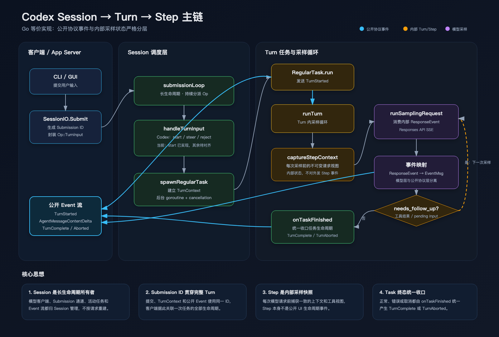

# Codex 源码一致性清单

本文件记录 LOB Codex 与 OpenAI Codex 源码的逐项映射。完成意味着 Go 实现保留了 Codex
对应模块的核心调用链、状态机、事件顺序、错误语义和生命周期，而不只是实现了相似功能。

## 一致性规则

- Codex 源码是主逻辑的唯一事实来源。
- Go 类型可以不同，但职责、输入、输出和状态转换必须等价。
- 平台相关实现允许不同，接口、授权边界和失败语义必须一致。
- 临时教学实现必须标记为“原型”，不能被视为已完成的 Codex 等价实现。
- 每个差异都要写明 Codex 行为、当前行为、偏离原因和补齐计划。

## 当前映射

| 能力 | Codex 源码 | LOB Codex | 状态 | 说明 |
|---|---|---|---|---|
| 协议事件 | `codex-rs/protocol` | `internal/protocol` | 部分对齐 | 已拆分 `ResponseEvent` 与公开 `Event/EventMsg`，实现 TurnStarted、文本 Delta、Error、TurnComplete、TurnAborted |
| Session/Turn | `codex-rs/core/src/session` | `internal/session` | 部分对齐 | 已还原 Submission 通道、后台 submission loop、RegularTask、TurnContext、内部 StepContext 和任务结束生命周期 |
| 模型客户端 | `codex-rs/core` 模型客户端 | `internal/model` | 部分对齐 | 已接 Responses SSE 并由 Turn 映射公开事件；请求构造、重试和完整 ResponseItem 尚未对齐 |
| 工具路由 | `codex-rs/core/src/tools` | `internal/tools` | 未开始 | 必须复现注册、路由、审批和结果回传流程 |
| 命令执行 | `codex-rs/core/src/exec.rs` | `internal/execution` | 未开始 | 必须保留取消、超时、输出截断和沙箱边界 |
| MCP | `codex-rs/core/src/mcp.rs` | `internal/mcp` | 未开始 | 必须对齐连接、工具刷新、审批和调用语义 |
| App Server | `codex-rs/app-server` | `internal/appserver` | 原型 | 服务现持有长生命周期 Session；线程路由和多会话协议尚未实现 |

## Session → Turn → Step 调用链

可编辑源图位于 [`diagrams/session-turn-step.svg`](./diagrams/session-turn-step.svg)。

| 顺序 | Codex | LOB Codex |
|---|---|---|
| 1 | `SessionIo::submit` 创建 `Submission` | `IO.Submit` 创建 `Submission` |
| 2 | `submission_loop` 分派 `Op` | `submissionLoop` 分派 `Op` |
| 3 | `turn_input::handle` 决定 start/steer/reject | `handleTurnInput` 当前实现 start，steer/reject 语义待补 |
| 4 | `Session::spawn_task/start_task` 启动后台任务 | `spawnRegularTask` 启动可取消 goroutine |
| 5 | `RegularTask::run` 发送 `TurnStarted` | `runRegularTask` 发送 `TurnStarted` |
| 6 | `run_turn` 捕获 `StepContext` 并循环采样 | `runTurn` 捕获 `StepContext` 并保留 follow-up 循环 |
| 7 | `run_sampling_request` 消费 `ResponseEvent` | `runSamplingRequest` 消费内部 `ResponseEvent` |
| 8 | `on_task_finished` 发送终态事件 | `onTaskFinished` 发送 TurnComplete/TurnAborted |

## 当前明确差异

- `TurnInputMode::StartOrSteer` 当前只实现空闲启动；运行中 steer 与 input queue 尚未实现。
- Conversation History、`ResponseItem` 和每次采样的完整 prompt 构造尚未实现，因此 GUI 仍是单轮模型上下文。
- 工具调用尚未产生 `needs_follow_up`，循环结构已保留但不会进入第二次采样。
- Codex 的 rollout 持久化、hooks、compaction、token 状态和启动预热尚未实现。
- 协议目前只覆盖这条最小调用链所需事件，字段也未覆盖全部 Codex 元数据。

## 下一步

继续对齐 Codex 的 Conversation History 与 `ResponseItem`：Turn 输入先记录到会话历史，每个
Step 从历史构造采样请求，模型完成项再写回历史。完成多轮上下文后，再进入 ToolRouter 和
`needs_follow_up` 工具循环。
